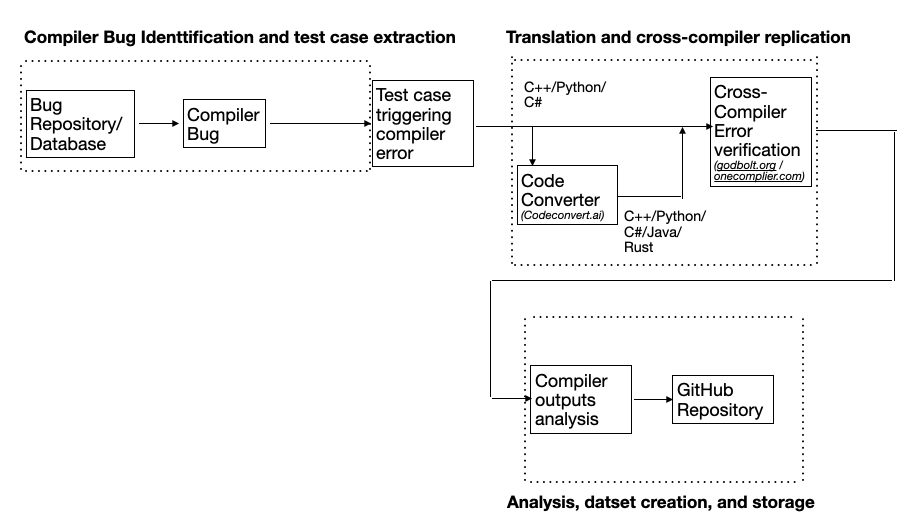

# Cross-compiler Bug Replication study and Dataset translation

 The scarcity of test case availability in the compiler testing domain and the availability of the opportunity to study the compiler bug replication from one language to another prompted us to explore the idea of finding similar bugs across languages. With numerous language and compiler choices available, we selected some of the most popular languages, C++, Python, Java, C#, and Rust, for our study. We limited the number of such bugs to 10 during this prototype phase due to a lack of time for a comprehensive study. We researched and analyzed various compiler bugs in the publicly available databases like Bugzilla, Python GitHub and Roslyn and handpicked 10 bugs for translation and further evaluation. 

To translate the test samples from one language to another, we evaluated different programming language translators available online and selected codecovert.ai [11], which performed reasonably well. We analyzed the transformed code to ensure that the transformation is bug-free and, if not, fixed it manually where possible. We also ensured that the code is transferable, as some functions in one language might not be available in another. For example, C++ has pointers, but Java does not. In most cases, Java translations had such limitations, which are documented. The translated codes are validated for compiler bugs using publicly available compiler websites for various languages like godbolt.org [12] and OneCompiler.com [13]. We documented each of our findings and summarized our observations. Finally, we stored the original test cases triggering the compiler errors and equivalent other language codes in a GitHub public repository to enable other developers to take advantage of them.
We fix the java code for Godbolt by removing the "public" in public class Main to allow for running of the code. Otherwise, it would not run. 

## Approach

The workflow of our approach is shown in Figure 1. The new or unresolved compiler bugs are identified by filtering and analyzing existing bugs in the bug databases. For C++ (gcc), we used bugzilla.org and for Python…..The sample code (source test case) causing the respective compiler bug is analyzed and converted into other languages (C++, Python, Java, C#, and Rust) using codeconvert.ai. Each converted code is analyzed further and used to replicate the bug in the corresponding other language (target). The translated codes are analyzed and fixed, if needed, for correctness. The converted code is used to replicate the same compiler bug by compiling them using the respective language compilers (X86-64 gcc 13.1, Python 3.13, jdk 21.0.2, .Net 9.0 CoreCLR, and rust 1.85.0) using godbolt.org / onecompiler.com. 
The findings of this replication study, whether the same error is raised in the target compiler or not,  are documented and stored in the corresponding bug folder created in GitHub. All the original codes (source) causing the compiler bugs and the equivalent other language codes (target) are stored in the GitHub repository along with the screenshots of the compiler outputs.

